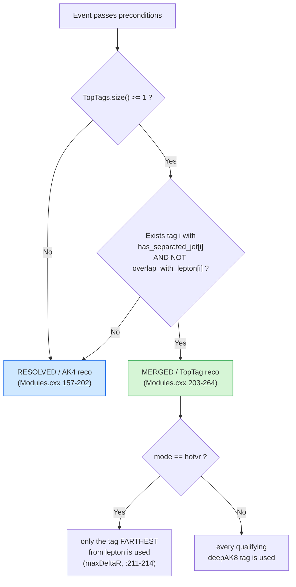
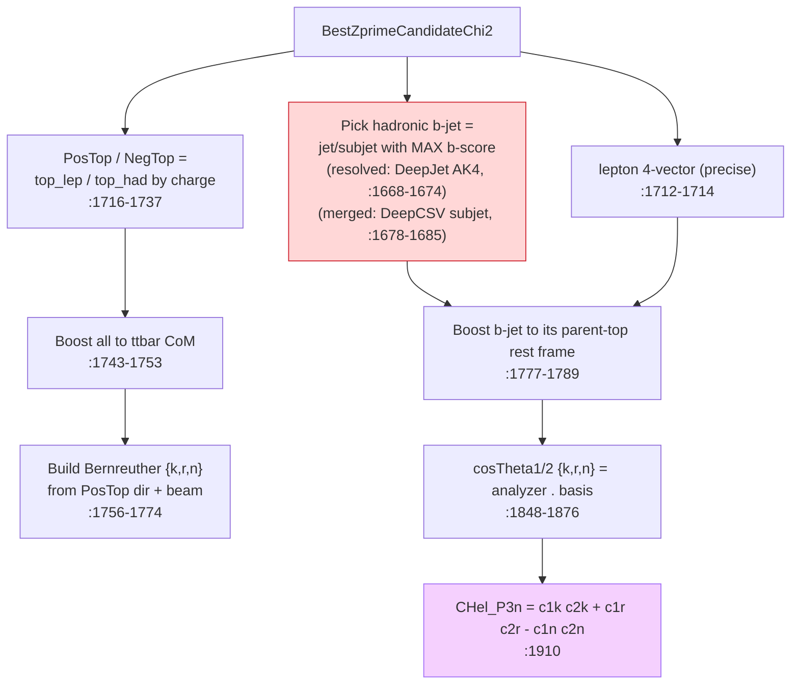
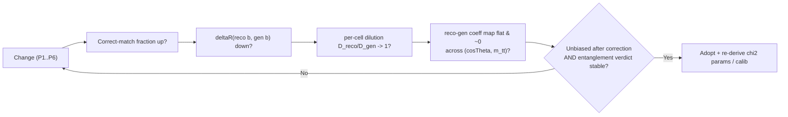

# Optimizing `ZprimeCandidateBuilder` for the entanglement observable `CHel_P3n`

**Goal.** This work supports a **Standard‑Model measurement of quantum entanglement between top quarks in the semileptonic t̄t channel** — *not* a Z′/resonance search. (The package is named `ZprimeSemiLeptonic` only because the analysis is built on that framework; nothing here looks for a new resonance.) The figure of merit is the helicity spin‑correlation coefficient extracted from the `cHel`/`CHel_P3n` distribution and read out across the `(cosΘ, m_{t̄t})` plane — the same plane CMS uses to delineate the "entangled" vs "separable" regions. The measurement targets the **entanglement that re‑emerges in the boosted, high‑`m_{t̄t}` region** (the semileptonic channel buys more boosted statistics than the dilepton channel). The **precise phase‑space boundaries — the `m_{t̄t}` floor and any `cosΘ` window — are not fixed a priori; they will be chosen from what the 2D coefficient maps reveal.** Because this is a *measurement*, the quantity we must control is **reconstruction‑induced bias and dilution of that coefficient**: any such effect propagates directly into the measured entanglement value and its systematic uncertainty.

**Scope.** Understand how `ZprimeCandidateBuilder` (`src/ZprimeSemiLeptonicModules.cxx`, lines 82–269) reconstructs the t̄t system across the different event scenarios, then evaluate where the reconstruction can be tuned so that the **lepton** and the **hadronic-side b‑jet** directions — the two inputs to the spin‑analyzer angle — are preserved as precisely as possible, since their angular resolution sets the dilution of the measured coefficient.

**Target observable.** `CHel_P3n`, defined in `src/ZprimeSemiLeptonicHists.cxx:1910`, filled into the histogram `cHel_P3n_Mtt800_Inf` (`:1926`) for events with `M(t̄t) > 800 GeV`:

```cpp
CHel_P3n = cosTheta1k*cosTheta2k + cosTheta1r*cosTheta2r - cosTheta1n*cosTheta2n;   // :1910
```

`cosTheta1{k,r,n}` and `cosTheta2{k,r,n}` are the projections of the two spin analyzers — the **charged lepton** and the **hadronic b‑jet** — onto the Bernreuther {k, r, n} helicity basis, each evaluated in its own parent‑top rest frame (`:1848–1876`). `CHel_P3n` is therefore, per event, a direct function of the reconstructed **lepton direction**, the reconstructed **hadronic b‑jet direction**, and the two reconstructed **top 4‑vectors** that define the rest frames and the basis. Every one of those comes out of `ZprimeCandidateBuilder` + the χ² selection.

**From distribution to measured coefficient.** The measured quantity is not the per‑event `CHel_P3n` but a *coefficient* extracted from its distribution: `coefficient = multiplier × A_FB`, the forward/backward asymmetry of the `cHel` distribution split at 0 (`macros/extractCoeff.py`, `multiplier = 5`). Since that split sits exactly at `cHel = 0`, `A_FB ≡ ⟨sign(cHel)⟩`, so the coefficient is now mapped across the measurement plane with two `TProfile2D`s — `cHel_coeff_Mtt_vs_cosThetaStar` and `cHel_P3n_coeff_Mtt_vs_cosThetaStar` (`Hists.cxx`, booked ~`:596`, filled ~`:1916`; x = `cos_PosTop_beam`, y = `m_{t̄t}` up to 2 TeV) — whose per‑cell mean of `5·sign(cHel)` equals the coefficient and whose bin error equals its statistical uncertainty. A 1D `cos_ThetaStar` histogram of the Bernreuther production angle (the plane's x‑axis) was added alongside. These maps are the instrument for **watching the reconstruction bias migrate across the measurement plane**, and are where the optimizations below should be judged.

> **TL;DR of the evaluation.** The builder enumerates jet→top assignments combinatorially and the χ² discriminator picks the candidate **using top masses only** — b‑tagging, jet‑direction quality, and the neutrino‑solution ambiguity play *no role* in selection. The b‑jet that enters `CHel_P3n` is then chosen *post‑hoc* in the Hists module as the highest‑b‑score jet among whatever the builder happened to assign to the hadronic top. The largest, cheapest gains for `CHel_P3n` come from making candidate **selection b‑tag‑aware** and from **constraining the hadronic‑top assignment to contain the b**, because both the b‑jet identity *and* the rest‑frame boost applied to it depend on the full hadronic‑top assignment.

---

## 1. Where `CHel_P3n` sits in the pipeline

```mermaid
flowchart LR
    A["Event: leptons, jets,<br/>MET, AK8 top-tags"] --> B["ZprimeCandidateBuilder<br/>(Modules.cxx 82-269)<br/><i>builds ALL candidates</i>"]
    B --> C["ZprimeChi2Discriminator<br/>(Modules.cxx 290-337)<br/><i>picks best by top-mass &chi;&sup2;</i>"]
    C --> D["BestZprimeCandidateChi2"]
    D --> E["ZprimeSemiLeptonicHists<br/>(Hists.cxx ~1543-1916)<br/><i>select had b-jet, build basis,<br/>boost to rest frames</i>"]
    E --> F["per-event CHel_P3n<br/>(Hists.cxx 1910)"]
    F --> G["coefficient maps<br/>cHel(_P3n)_coeff_Mtt_vs_cosThetaStar<br/>= 5&middot;sign(cHel) profiled over (cos&Theta;, m_tt)<br/>(Hists.cxx ~596 / ~1916)"]
    G --> H["MEASUREMENT:<br/>entanglement coefficient<br/>in the boosted region<br/><i>(phase space set from this map)</i>"]
    style B fill:#cfe8ff,stroke:#1f6feb
    style C fill:#ffe8c2,stroke:#d29922
    style E fill:#d6f5d6,stroke:#2da44e
    style F fill:#f5d0fe,stroke:#a371f7
    style G fill:#f5d0fe,stroke:#a371f7
    style H fill:#ffd7d7,stroke:#cf222e
```



The chain terminates not in a fixed slice but in the `(cosΘ, m_{t̄t})` coefficient maps: the **measurement region is the boosted, high‑`m_{t̄t}` band where SM top‑quark entanglement re‑emerges**, and its exact `m_{t̄t}` / `cosΘ` boundaries are to be **read off these maps**, not assumed a priori. The legacy `cHel_P3n_Mtt800_Inf` histogram (`:1926`) is just a single placeholder slice at 800 GeV; the maps generalize it so the cut can be chosen from what the data/MC actually show.

The histogram block consumes `h_BestZprimeCandidateChi2` (`Hists.cxx:1543`), i.e. the **χ²‑selected** candidate — not the correct‑match one. So the χ² discriminator is the gate that decides which reconstruction feeds the angle.

---

## 2. `ZprimeCandidateBuilder` — what it does, scenario by scenario

### 2.1 Preconditions and inputs

| Item | Source | Note |
|---|---|---|
| Primary lepton | `find_primary_lepton` (`:27–48`) | Highest‑pT among all `electrons` ∪ `muons`. Direction is **detector‑precise**. |
| Neutrino | `reconstruct_neutrino` (`:50–79`) | W‑mass quadratic in ν pₙ → **1 or 2** solutions. |
| AK4 jets | `event.jets` | PUPPI AK4. |
| Top‑tags | `h_AK8TopTags` / `…Ptr` | `DeepAK8TopTags` if `mode="deepAK8"`, `HOTVRTopTags` if `mode="hotvr"` (`:86–94`). |

Hard requirements (throw if unmet, `:117–119`): ≥1 lepton; and either ≥2 AK4 jets, or (≥1 AK4 jet **and** ≥1 top‑tag).

### 2.2 Neutrino reconstruction (the first multiplicity source)

```cpp
float discriminant = B*B - A*C;            // :60
if (discriminant <= 0) -> 1 real-pz solution (take -B/A)        // :62-67
else                   -> 2 solutions (-B ± sqrt(disc))/A       // :68-77
```

| Case | # ν solutions | Consequence downstream |
|---|---|---|
| `discriminant ≤ 0` | 1 | Single leptonic‑top hypothesis. |
| `discriminant > 0` | 2 | **Both** pₙ solutions are propagated; the candidate list is duplicated over `neutrinos`. The χ² later picks one *implicitly* via the mass fit. |

Every candidate stores `neutrinoindex` and `neutrino_v4` (`:196–197`, `:256–257`).

### 2.3 The reconstruction‑mode decision (top‑tag vs. resolved AK4)

This is the central branch. Two per‑top‑tag boolean vectors are built first:

| Flag | Built at | Meaning |
|---|---|---|
| `has_separated_jet[i]` | `:122–129` | Top‑tag *i* has ≥1 AK4 jet with `ΔR > 1.2` (needed to build the *leptonic* side). |
| `overlap_with_lepton[i]` | `:131–146` | Top‑tag *i* is too close to the lepton: `ΔR < 0.8` (deepAK8) or `ΔR < 1.5` (hotvr) ⇒ treated as overlapping. |

Then:

```cpp
do_toptag_reco = false;
for each top-tag i:
    if (has_separated_jet[i] && !overlap_with_lepton[i]) do_toptag_reco = true;   // :148-155
```



### 2.4 Branch A — Resolved / AK4 reconstruction (`:157–202`)

Each AK4 jet (capped at `njets = min(N,10)`, `:159–160`) is independently assigned to one of **three** roles via base‑3 digits of the loop index — giving `3^njets` candidates **per neutrino solution**:

| `num % 3` | Role | Code |
|---|---|---|
| `0` | → **hadronic** top | `:176–179` |
| `1` | → **leptonic** top | `:180–183` |
| `2` | → unused (assigned to neither) | (implicit) |

Candidates with an empty hadronic or empty leptonic jet list are skipped (`:187`). For each surviving candidate:

```cpp
top_hadronic_v4 = Σ (hadronic jets)                          // :177, :191
top_leptonic_v4 = lepton + neutrino + Σ (leptonic jets)      // :168, :181, :192
Zprime_v4       = top_hadronic_v4 + top_leptonic_v4          // :190
is_toptag_reconstruction = false ; is_puppi_reconstruction = false   // :172-173
```

### 2.5 Branch B — Merged / TopTag reconstruction (`:203–264`)

The hadronic top **is** the top‑tag jet (fixed). Only AK4 jets with `ΔR(jet, tag) > minDR_` are "separated" and eligible (`:217–220`). Those are distributed over **two** roles via base‑2 digits → `2^njets` candidates per (neutrino × qualifying tag):

| `num % 2` | Role | Code |
|---|---|---|
| `0` | → **leptonic** top | `:239–242` |
| `1` | → unused | (implicit) |

```cpp
top_hadronic_v4 = toptag.v4()                               // :228, :250  (b is INSIDE this AK8 jet)
top_leptonic_v4 = lepton + neutrino + Σ (separated jets)     // :231, :240, :251
tophad_topjet_ptr = toptag_ptr                              // :254  (keeps subjets for later)
is_toptag_reconstruction = true ; is_puppi_reconstruction = true     // :235-236
```

For `mode="hotvr"`, an extra cut keeps only the tag farthest from the lepton (`:211–214`).

### 2.6 Scenario → behavior matrix

| Scenario | Branch | Candidates built (per ν solution) | Hadronic b‑jet lives in… |
|---|---|---|---|
| No top‑tag, N AK4 jets | Resolved | `3^min(N,10)` (minus empty‑side combos) | one of the AK4 jets assigned to had top |
| Top‑tag present but overlapping lepton / no separated jet | Resolved (falls back) | as above | one of the AK4 jets |
| deepAK8 tag(s), qualifying | Merged | `Σ_tags 2^min(Nsep,10)` | a **subjet** of the AK8 top‑tag |
| hotvr tag(s), qualifying | Merged (farthest tag only) | `2^min(Nsep,10)` | a **subjet** of the HOTVR jet |

**Key structural facts for the optimization:**
1. The builder enumerates assignments; it encodes **no preference** for which jet is the b, nor for direction quality.
2. In resolved mode the hadronic top can be built from **any** subset of jets — it may omit the true b or absorb wrong jets, which both shifts `top_hadronic_v4` (the boost) and changes which jets are even *candidates* for the post‑hoc b‑jet pick.
3. Up to 10 jets and two ν solutions → candidate lists of `O(2·3^10) ≈ 1.2×10^5` in busy resolved events; selection quality is entirely on the χ².

---

## 3. The χ² selection — what it optimizes (and what it ignores)

`ZprimeChi2Discriminator` (`:290–337`) scores every candidate by top **masses only**:

```cpp
chi2 = (mhad - mtophad)^2/σhad^2 + (mlep - mtoplep)^2/σlep^2;   // :313-323
```

| Parameter | Resolved | Top‑tag | Source |
|---|---|---|---|
| `mtophad` / `σ` | 173.0 / 21.2 | 180.6 / 15.6 | `:280–286` |
| `mtoplep` / `σ` | 173.6 / 24.6 | 171.4 / 22.0 | `:278–284` |
| `mhad` definition | `inv_mass(Σ had jets)` (`:317`) | Σ‑subjets mass (puppi, `:308–310`) or softdrop (`:306`) | `:304–320` |

The lowest‑χ² candidate is stored as `ZprimeCandidateBestChi2` (`:329–334`).

**What the selection never uses:** b‑tagging, the lepton/b directions, angular consistency, or which neutrino solution is more physical. Two candidates that differ only by *which* jet is the b — or by the ν pₙ branch — are distinguished **only** through their effect on the fitted masses, which is weak. This is the root cause of most directional dilution in `CHel_P3n`.

---

## 4. Downstream: how the angle is actually formed (`Hists.cxx`)



Two consequences worth emphasizing:

- The **b‑jet identity is decided in the Hists module, not the builder** (`:1668–1685`), by maximum b‑score over the hadronic jets the builder produced. If the builder put the true b on the leptonic side, no post‑hoc pick can recover it.
- The b‑jet is boosted into the **hadronic‑top rest frame defined by `top_hadronic_v4`** (`:1784/1788`), and the whole {k,r,n} basis is built from `PosTop` (`:1759`). Both depend on the *entire* hadronic‑top assignment and on the ν solution — so jet‑assignment errors rotate the b direction **even when the b jet itself is correct**.

The code already books a diagnostic for exactly this: `deltaR_hadTop_bGen` = ΔR(reco b, gen b) in the merged topology (`:1704–1706`). That handle is the natural figure of merit for the b‑direction (see §6).

---

## 5. Evaluation — where lepton & b‑jet precision is lost

| Input to `CHel_P3n` | Reconstructed by | Precision status | Failure mode |
|---|---|---|---|
| **Lepton direction** | `find_primary_lepton` | **Excellent** (detector lepton) | Essentially none — leave as is. |
| **Hadronic b‑jet identity** | post‑hoc max b‑score over builder's hadronic jets | **Fragile** | True b assigned to leptonic side, or never grouped into had top ⇒ wrong jet picked. χ² can't see this. |
| **Hadronic b‑jet direction** | AK4 PUPPI jet (resolved) / AK8 subjet (merged) | **Moderate** | Jet angular resolution; b‑score from CHS jet but kinematics from PUPPI jet (resolved, `:1668–1674`) → identity/direction can come from different objects. |
| **Hadronic‑top boost (`top_hadronic_v4`)** | Σ of assigned had jets / AK8 v4 | **Coupled** | Wrong/missing jets in had top rotate & rescale the rest‑frame boost applied to the b. |
| **Leptonic‑top boost & basis (`PosTop`)** | lepton+ν+jets; ν pₙ branch | **Coupled** | Wrong ν solution or wrong lep‑side jets tilt the {k,r,n} basis for *both* analyzers. |

Physics amplifier (why this matters for a *measurement*): the b‑quark spin‑analyzing power (≈ −0.4) is already much weaker than the lepton's (≈ +1), so the hadronic side carries less spin information to begin with. Any directional dilution of the b therefore costs disproportionately — it pulls the extracted coefficient toward zero, i.e. it *dilutes the measured entanglement* rather than merely losing sensitivity. The effect is largest in the high‑`m_{t̄t}` / boosted region where jets merge and assignment is hardest, so it does not cancel: it is a topology‑ and `m_{t̄t}`‑dependent systematic that must be calibrated and minimized, and it will show up as a structured pattern across the `(cosΘ, m_{t̄t})` coefficient maps.

---

## 6. Concrete, code‑level optimization proposals

Ordered by expected impact‑to‑effort. None of these is committed code — each gives the location, a sketch, the expected effect on `CHel_P3n`, and the cost/risk.

### P1 — Make candidate selection b‑tag aware (highest impact)

**Problem.** χ² ignores b‑tagging, so the true b often ends up on the wrong side / wrong jet, and the boost frame is built from a mis‑assigned hadronic top.

**Where.** `ZprimeChi2Discriminator::process` (`Modules.cxx:290–337`), or a new discriminator run alongside it. The candidate already carries `jets_hadronic()` / `tophad_topjet_ptr()`; b‑scores are available via the CHS‑matched collection used in `Hists.cxx`.

**Sketch.** Add a b‑tag consistency term to the score (or use it as a hard prior):

```cpp
// after computing chi2_had, chi2_lep:
float btag_penalty = 0.;
// resolved: reward a b-tagged jet on the hadronic side, penalize a b-tag stranded on lepton side
float bmax_had = max_bscore(candidate.jets_hadronic());      // via CHS match, as in Hists
float bmax_lep = max_bscore(candidate.jets_leptonic());
if (bmax_had < WP_medium) btag_penalty += w1;               // hadronic top has no b
if (bmax_lep < WP_medium) btag_penalty += w2;               // leptonic top has no b
float score = chi2_had + chi2_lep + btag_penalty;           // tune w1,w2 on correct-match MC
```

**Expected effect.** Higher correct‑match fraction ⇒ the right jet is available as the b *and* the hadronic‑top boost is built from the right jets ⇒ less dilution of `cosTheta2{k,r,n}`. This is the single largest lever for `CHel_P3n`.

**Cost/risk.** Must re‑tune `w1,w2` (and ideally re‑derive the χ² mass means/σ) on `ZprimeCorrectMatchDiscriminator` truth (`:354–529`). Keep the pure‑χ² path available for systematics comparison.

### P2 — Constrain/prune the combinatorics so the hadronic top must contain a b

**Problem.** In resolved mode the builder enumerates assignments where the hadronic top has **no** b‑tagged jet — physically wrong, but still scored.

**Where.** `Modules.cxx:175–198` (the ternary assignment loop).

**Sketch.** Skip candidates whose hadronic jet set has no medium‑WP b‑tag, and (optionally) require the leptonic side to carry a b:

```cpp
if (tophadjets.size() < 1 || toplepjets.size() < 1) continue;        // existing :187
if (max_bscore(tophadjets) < WP_medium) continue;                    // NEW: had top needs a b
```

**Expected effect.** Shrinks the candidate list (faster) and removes the configurations most likely to give a wrong b direction. Complementary to P1; P2 prunes, P1 ranks.

**Cost/risk.** A small efficiency loss when the b is mis‑tagged; mitigate by falling back to the unconstrained list if zero candidates survive.

### P3 — Resolve the neutrino two‑fold ambiguity deliberately

**Problem.** When `discriminant > 0` both pₙ solutions enter (`:68–77`); the χ² picks one only through its weak mass effect, yet the choice tilts `top_leptonic_v4` → `PosTop` → the **entire {k,r,n} basis** (`Hists.cxx:1759`).

**Where.** `reconstruct_neutrino` (`:50–79`) and/or the selection.

**Options.**
- Prefer the solution with the **smaller |pₙ|** (standard, reduces forward‑tail bias), or
- Prefer the solution giving the more central leptonic top / better |m_lep − m_top|, decided *jointly* with the b‑assignment rather than per‑candidate.

```cpp
// e.g. tag each candidate's neutrinoindex and, on ties in score, prefer min|pz|
```

**Expected effect.** Stabilizes the helicity basis, improving *both* `cosTheta1` and `cosTheta2` simultaneously — and the basis enters `CHel_P3n` quadratically through k,r,n, so basis errors are not benign.

**Cost/risk.** Low; mostly a tie‑break policy. Validate that it doesn't bias `M(t̄t)` near the 800 GeV boundary.

### P4 — Make the b‑jet kinematics and the b‑score come from the same object (resolved)

**Problem.** In resolved mode the b is *identified* by the **CHS‑matched** jet's DeepJet score but its **4‑vector is taken from the PUPPI** `jets_hadronic()` jet (`Hists.cxx:1640–1641` vs `:1671–1674`). The matching is nearest‑ΔR and can disagree, so identity and direction can reference slightly different objects.

**Where.** `Hists.cxx:1628–1685` (and the identical logic in `ZprimeAnalysisModule_EFT.cxx:1225–1265`).

**Sketch.** Decide the b on the matched pair and read the direction from a single, consistent source (prefer the PUPPI jet direction for kinematics, but guard the match):

```cpp
int best = -1; float best_b = -2;
for (i in jets_hadronic) {
   const Jet* chs = nearest_CHS(jets_hadronic[i]);   // require dR < 0.2, else skip
   if (chs && chs->btag_DeepJet() > best_b) { best_b = chs->btag_DeepJet(); best = i; }
}
had_top_b = jets_hadronic[best].v4();                // single source of direction
```

**Expected effect.** Removes a subtle identity/direction mismatch; tightens `deltaR_hadTop_bGen` and hence `cosTheta2`.

**Cost/risk.** Very low; mostly hygiene. Add the missing ΔR guard on the CHS match (currently the nearest match is accepted unconditionally).

### P5 — Store the chosen b‑jet in the candidate (decouple builder from Hists)

**Problem.** The b‑jet choice is duplicated in `Hists.cxx` and `ZprimeAnalysisModule_EFT.cxx` and is invisible to the selection. Selection and analysis can therefore disagree about "the b."

**Where.** `ZprimeCandidate.h` (add `m_had_b_v4` + getter/setter; the class already follows this pattern, `:30–42`) and set it in the builder/selection once b‑awareness exists (P1).

**Expected effect.** Guarantees the object the χ² optimized for is the object whose direction feeds `CHel_P3n`; eliminates a class of silent inconsistencies and de‑duplicates ~40 lines.

**Cost/risk.** Mechanical refactor; touch points are few.

### P6 — Use the best directional proxy in the merged topology

**Problem.** Merged mode takes the b as the AK8 **subjet** with max **DeepCSV** (`Hists.cxx:1678–1685`). Subjet axes are coarser than the b‑hadron flight direction, and DeepCSV is the older tagger.

**Where.** `Hists.cxx:1652–1685`.

**Options.** Evaluate (a) ParticleNet/DeepJet subjet scores if available, (b) using the subjet with the highest *charged*‑constituent‑weighted axis, and (c) the existing `deltaR_hadTop_bGen` (`:1706`) to quantify which proxy is closest to the gen b.

**Expected effect.** Directly reduces b‑direction dilution in the high‑`M(t̄t)` (most boosted) regime that `cHel_P3n_Mtt800_Inf` targets.

**Cost/risk.** Depends on which subjet taggers are in the ntuples; measure before switching.

---

## 7. How to validate any change (a measurement‑grade loop)

For a measurement the bar is not "sharper resolution" but **a coefficient that is unbiased after correction, with the smallest dilution**. The repo already contains most of the machinery; the validation loop is:

1. **Reco‑vs‑gen coefficient bias across the plane.** The decisive test: book the same `cHel_P3n_coeff_Mtt_vs_cosThetaStar` `TProfile2D` at gen level (truth lepton + truth hadronic b, truth tops) and at reco level, then take the **reco − gen** difference map. A flat, near‑zero difference means the reconstruction does not bias the coefficient; any structure (especially toward high `m_{t̄t}`) is the systematic to fix. This is the primary figure of merit, replacing the old single‑slice check.
2. **Correct‑match fraction.** Run `ZprimeCorrectMatchDiscriminator` (`:354–529`) and compare the χ²‑selected candidate to the correct‑match candidate before/after each change. Target: fraction of events where χ² picks the truth‑matched assignment — the upstream driver of the bias in step 1.
3. **b‑direction resolution.** Histogram `deltaR_hadTop_bGen` (`:1704–1706`) — extend it to the resolved topology too (currently merged‑only) and split by `(cosΘ, m_{t̄t})` cell. This is the microscopic cause of dilution.
4. **Dilution factor.** From the reco‑vs‑gen `CHel_P3n` migration, extract the per‑cell dilution `D_reco/D_gen`; the optimizations should push it toward 1, uniformly across the plane (uniformity matters more than the average for a measurement, since non‑uniform dilution distorts the entangled/separable boundary).
5. **Basis stability.** Check `cos_ThetaStar` (now booked) and the ν‑solution choice distributions don't develop a reco bias vs gen — a tilt in the production angle would shift events across `cosΘ` columns and migrate the boundary (P3).
6. **Closure on the entanglement conclusion.** Confirm the *sign/threshold* of the measured coefficient in the **boosted measurement region** (the high‑`m_{t̄t}` band where entanglement re‑emerges) is recovered after correction — i.e. the optimization does not move the "entangled vs separable" verdict by reconstruction alone. Use the reco‑vs‑gen coefficient map (step 1) to **define the measurement phase space**: pick the `m_{t̄t}` floor / `cosΘ` window where the coefficient is both entangled at gen level *and* low‑bias after reconstruction, rather than imposing a fixed cut up front.



---

## 8. Quick file/line reference

| What | File | Lines |
|---|---|---|
| `find_primary_lepton` | `src/ZprimeSemiLeptonicModules.cxx` | 27–48 |
| `reconstruct_neutrino` (1 vs 2 sol.) | same | 50–79 |
| `ZprimeCandidateBuilder` ctor (mode/handles) | same | 82–96 |
| Preconditions / throws | same | 117–119 |
| `has_separated_jet`, `overlap_with_lepton` | same | 122–146 |
| `do_toptag_reco` decision | same | 148–155 |
| Resolved (AK4) combinatorics `3^n` | same | 157–202 |
| Merged (top‑tag) combinatorics `2^n` | same | 203–264 |
| `ZprimeChi2Discriminator` (mass‑only) | same | 272–337 |
| `ZprimeCorrectMatchDiscriminator` (truth) | same | 354–529 |
| `ZprimeCandidate` members/setters | `include/ZprimeCandidate.h` | 7–62 |
| b‑jet selection (resolved/merged) | `src/ZprimeSemiLeptonicHists.cxx` | 1628–1685 |
| Top 4‑vectors by charge | same | 1716–1737 |
| Boost to ttbar CoM | same | 1743–1753 |
| Bernreuther {k,r,n} basis | same | 1756–1774 |
| Boost analyzers to top rest frames | same | 1777–1789 |
| `cosTheta1/2 {k,r,n}` projections | same | 1848–1876 |
| **`CHel_P3n` definition** | same | **1910** |
| **`cHel_P3n_Mtt800_Inf` fill** | same | **1926–1928** |
| **Coefficient maps `cHel(_P3n)_coeff_Mtt_vs_cosThetaStar` (book / fill)** | same | **~596 / ~1916** |
| **`cos_ThetaStar` production‑angle hist (book / fill)** | same | **~531 / ~1766** |
| Coefficient extraction (`5 × A_FB`, multiplier table) | `macros/.../extractCoeff.py` | — |
| Same b/lepton logic (Δφ/Σφ) duplicate | `src/ZprimeAnalysisModule_EFT.cxx` | 1225–1356 |
| `deltaR_hadTop_bGen` diagnostic | `src/ZprimeSemiLeptonicHists.cxx` | 1704–1706 |
